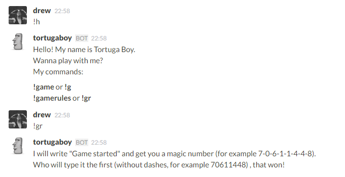

# Tortugaboy
Tortugaboy is a [Slack](https://slack.com/) game bot.



## Installation

1. Clone the repo
2. `pip install -r requirements.txt`
3. Host the web app on [Heroku](http://heroku.com):

    ```
    heroku create
    git push heroku master
    heroku ps:scale web=1
    heroku logs
    ```
4. Set up some config variables using `heroku config:set VARIBLE=value`:
   - `TOKEN`: your team's Slack API token. (required)
   - `USERNAME`: your bot's username. (optional; defaults to `'tortugaboy'`)
   - `ICON_EMOJI`: the emoji used in the bot's icon. (optional; defaults to `':moyai:'`)
   - `CHANNEL`: the channel in which you stand up. (optional; defaults to `'#random'`)
  
5. Add the URL where the web app is deployed as an [outgoing webhook](https://my.slack.com/services/new/outgoing-webhook) in Slack. Don't forget the trailing `/`!
6. Type `!help` in your chosen channel to see help message and `!game` to start the game.

## Thanks
This bot totally based on https://github.com/eelzon/morgenbot by @eelzon, Thank you.

## Contributors
* @drew2a